# Application Flow Diagrams

This document summarizes **all major flows** of the **ID O2O Multi Payment Gateway** app — from Shopify installation and merchant configuration through checkout creation, payment callbacks, and compliance.

**Related documents:**

- [README](../README.md) — setup, env, endpoint overview
- [PUBLIC-BRIDGE-API.md](./PUBLIC-BRIDGE-API.md) — server-to-server integration (bridge, InvStatus, payment-status)
- [SHOPIFY-PARTNER-TESTING.md](./SHOPIFY-PARTNER-TESTING.md) — credentials for App Store review

---

## Table of contents

1. [High-level architecture](#1-high-level-architecture)
2. [Shopify installation & OAuth](#2-shopify-installation--oauth)
3. [Merchant configuration (gateway credentials)](#3-merchant-configuration-gateway-credentials)
4. [Checkout creation entry points](#4-checkout-creation-entry-points)
5. [Checkout flow by provider](#5-checkout-flow-by-provider)
6. [Swipe (EDC) flow — detail](#6-swipe-edc-flow--detail)
7. [Payment provider webhooks](#7-payment-provider-webhooks)
8. [Shopify payment session (Payments Apps API)](#8-shopify-payment-session-payments-apps-api)
9. [Manual payment — orders/create webhook](#9-manual-payment--orderscreate-webhook)
10. [Bridge API (server-to-server)](#10-bridge-api-server-to-server)
11. [Status polling & payload audit](#11-status-polling--payload-audit)
12. [Shopify compliance webhooks (GDPR)](#12-shopify-compliance-webhooks-gdpr)
13. [Data storage](#13-data-storage)
14. [Endpoint summary by flow](#14-endpoint-summary-by-flow)

---

## 1. High-level architecture

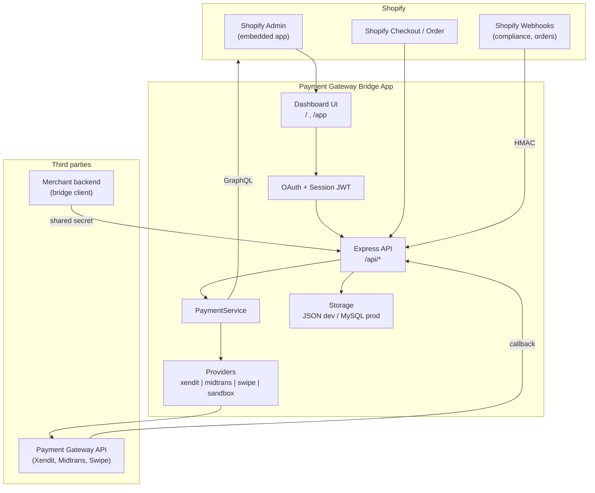


**Key roles:**


| Component                | Purpose                                                                                 |
| ------------------------ | --------------------------------------------------------------------------------------- |
| **Embedded UI** (`/app`) | Merchant enters gateway credentials, OAuth, demo checkout                               |
| **PaymentService**       | Orchestrates checkout creation + webhook handling                                       |
| **Providers**            | Adapters for Xendit, Midtrans, Swipe, Sandbox                                           |
| **Storage**              | Store config, OAuth tokens, payment session context, redirect records, compliance audit |


---

## 2. Shopify installation & OAuth

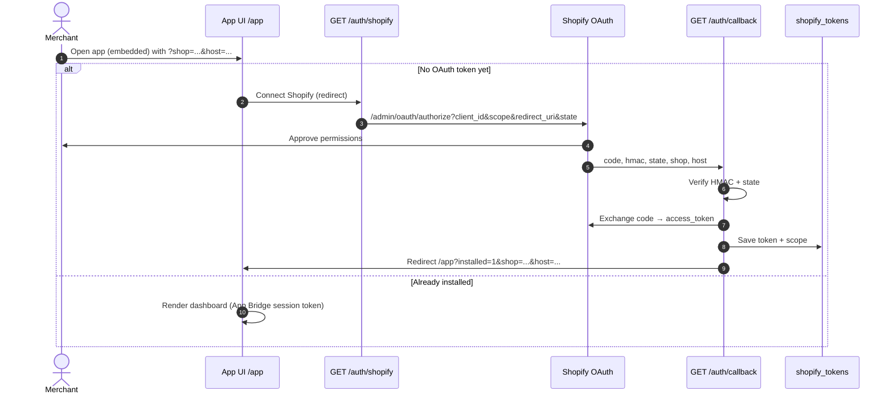


**Notes:**

- Tokens are stored per shop (`shopify_tokens`).
- Embedded APIs are protected with `**Authorization: Bearer <session JWT>`** (App Bridge), verified using `SHOPIFY_API_SECRET`.
- Check install status: `GET /auth/shopify/status/:shop`.

---

## 3. Merchant configuration (gateway credentials)

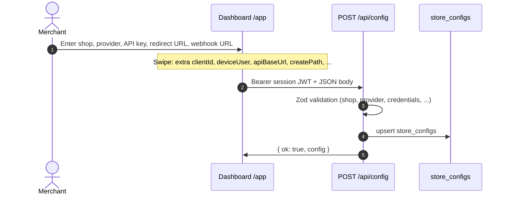


**Data stored per store:**


| Field                  | Description                                                                        |
| ---------------------- | ---------------------------------------------------------------------------------- |
| `shop`                 | Merchant domain                                                                    |
| `provider`             | `xendit` | `midtrans` | `swipe` | `sandbox` | `custom`                             |
| `credentials.apiKey`   | Provider API key / merchant ID                                                     |
| `credentials.extra.`*  | Swipe: `clientId`, `deviceUser`, `apiBaseUrl`, `createPath`, `paymentMethod`, etc. |
| `redirectUrlAfterPaid` | Browser URL after successful payment                                               |
| `webhookUrlAfterPaid`  | Optional override for provider callback URL                                        |


**Endpoints:** `POST /api/config` (JWT) · `GET /api/config/:shop` (JWT)

---

## 4. Checkout creation entry points

A single checkout transaction can be **started** from several paths:

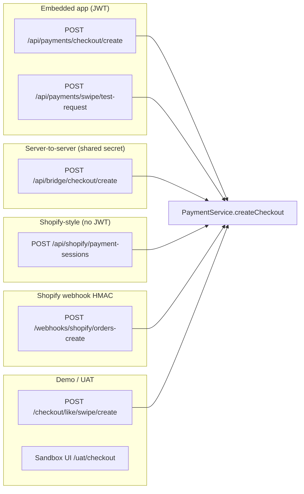


All paths above (except the pure sandbox UI) eventually call `**PaymentService.createCheckout**`, which:

1. Loads `store_configs` for the shop
2. Calls the matching provider
3. Saves a `**payment_redirects**` record (status `pending`) for status polling

---

## 5. Checkout flow by provider

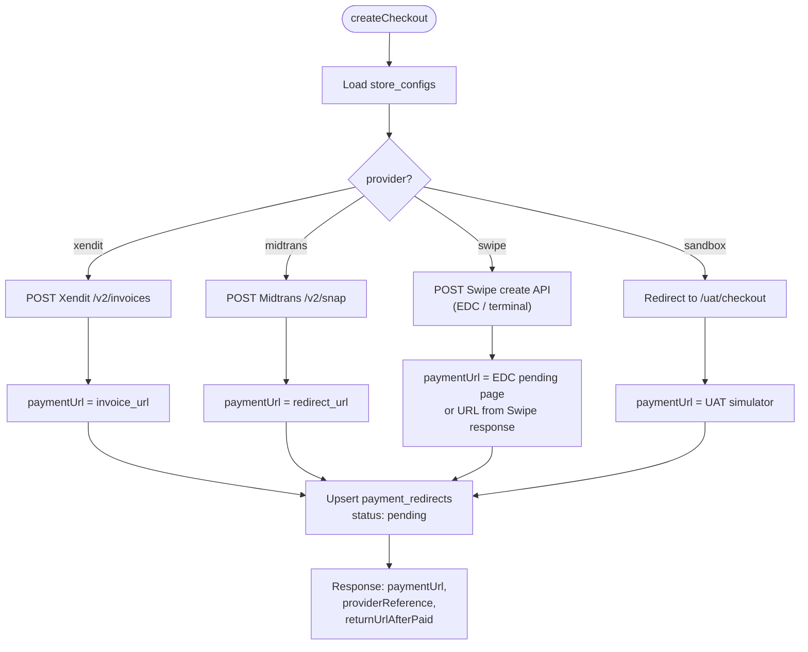


| Provider     | `paymentUrl` behavior                     | Webhook callback                        |
| ------------ | ----------------------------------------- | --------------------------------------- |
| **Xendit**   | Xendit invoice page                       | `POST /webhooks/payment/xendit/:shop`   |
| **Midtrans** | Snap redirect                             | `POST /webhooks/payment/midtrans/:shop` |
| **Swipe**    | EDC pending page or terminal instructions | `POST /webhooks/payment/swipe?shop=...` |
| **Sandbox**  | Local simulator                           | `POST /webhooks/payment/sandbox/:shop`  |


---

## 6. Swipe (EDC) flow — detail

`device_user`, `client_id`, and other Swipe credentials come from the **initial configuration** (`credentials.extra`). On create, the app sends this body to the Swipe API:

```json
{
  "pos_request_type": "Postman",
  "request_id": "ReqId-...",
  "client_id": "<from config>",
  "device_user": "<from config>",
  "payment_method": "CDCP",
  "invoice_number": "INV-<orderId>",
  "amount": 30,
  "callback_url": "https://{HOST}/webhooks/payment/swipe?shop=...",
  "additional_param": { "fee_agent_amount": 0, ... }
}
```

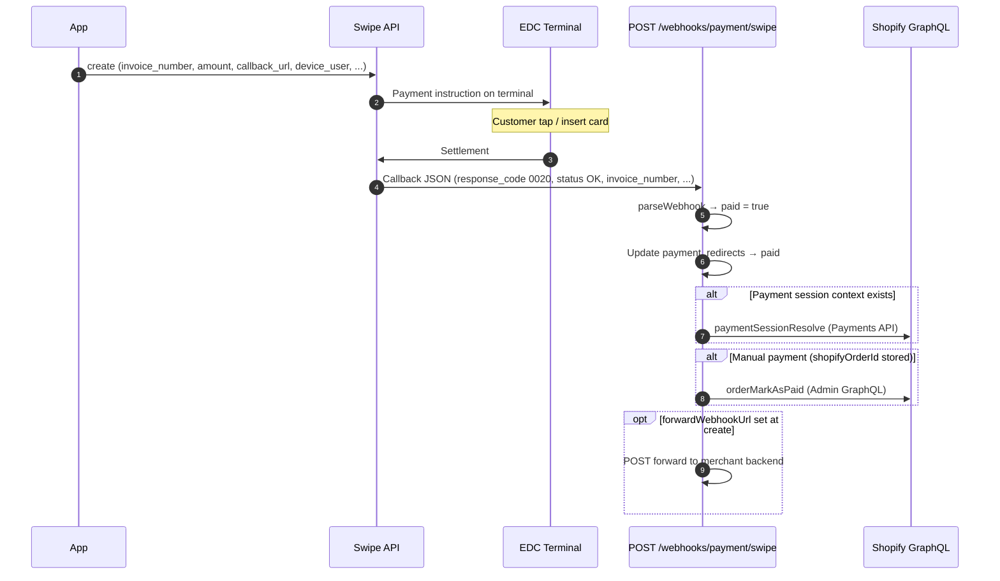


**Swipe success criteria (`paid`):**

- `response_code` = `00`, `000`, or `0020`
- `status` = `OK`
- `message` contains `APPROVED`

**Order matching:** the `invoice_number` key (e.g. `INV-order6687782928520`) must match the value sent at create time.

---

## 7. Payment provider webhooks

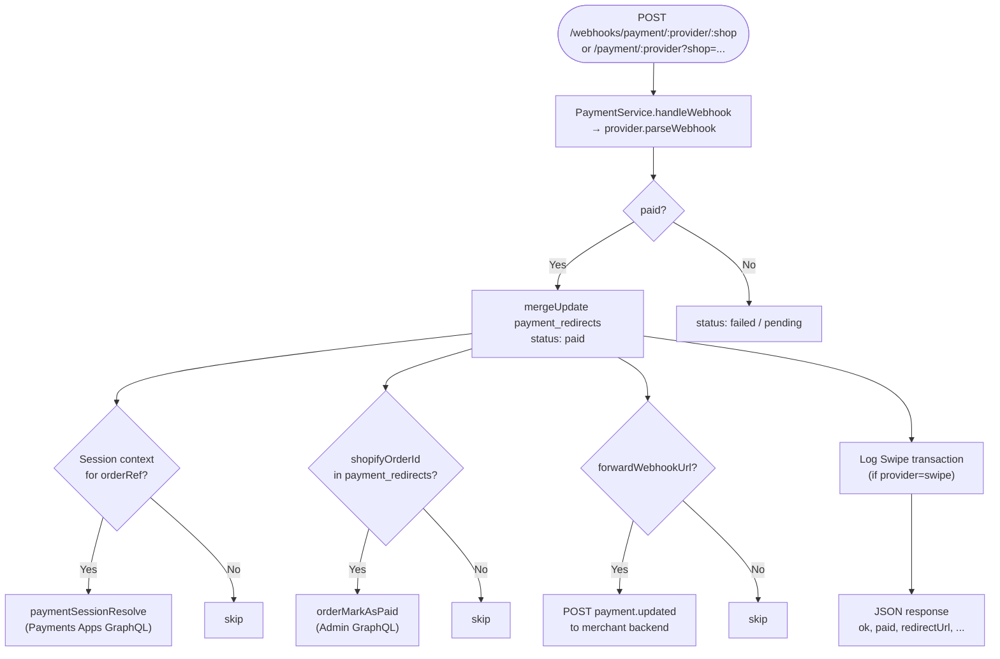


**Example Swipe callback (after EDC payment):**

```json
{
  "response_code": "0020",
  "status": "OK",
  "message": "SALE APPROVED.",
  "invoice_number": "INV-order6687782928520",
  "payment_method": "CDCP",
  "device_user": "merchanttest02",
  "approval_code": "R33769",
  "masked_pan": "542640****1588"
}
```

---

## 8. Shopify payment session (Payments Apps API)

This flow mirrors the **Payments Apps API** — Shopify (or an integrator) creates a payment session; the app returns a redirect URL to the gateway.

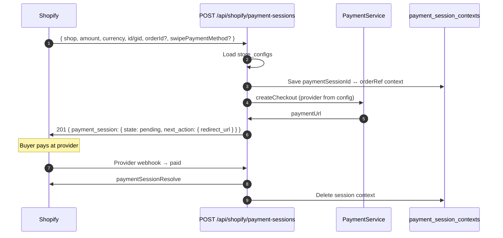


**Related endpoints:**


| Method | Path                                        | Description               |
| ------ | ------------------------------------------- | ------------------------- |
| `POST` | `/api/shopify/payment-sessions`             | Create session + checkout |
| `POST` | `/api/shopify/payment-sessions/:id/resolve` | Stub resolve (testing)    |
| `POST` | `/api/shopify/payment-sessions/:id/reject`  | Stub reject (testing)     |


Production resolve is actually triggered from the **provider webhook** via `ShopifyPaymentResolveService`.

---

## 9. Manual payment — orders/create webhook

For manual payment methods in Shopify (order `financial_status: pending`), the app can automatically trigger Swipe create when an order is created.

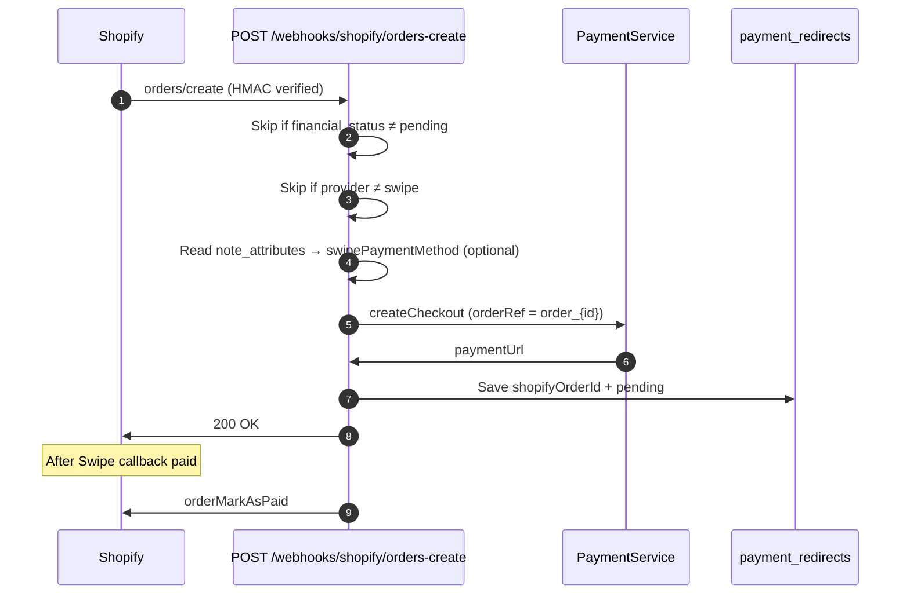


---

## 10. Bridge API (server-to-server)

For merchant backends **without** a Shopify session JWT — see [PUBLIC-BRIDGE-API.md](./PUBLIC-BRIDGE-API.md) for details.

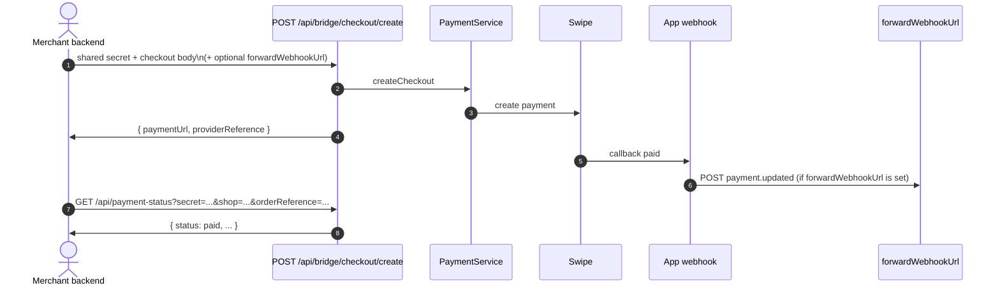


**Two-URL pattern (recommended for Swipe):**

1. **Swipe → app:** `{HOST}/webhooks/payment/swipe?shop=...` (required; updates internal status)
2. **App → merchant backend:** `forwardWebhookUrl` (optional; ERP/WP notification)

---

## 11. Status polling & payload audit

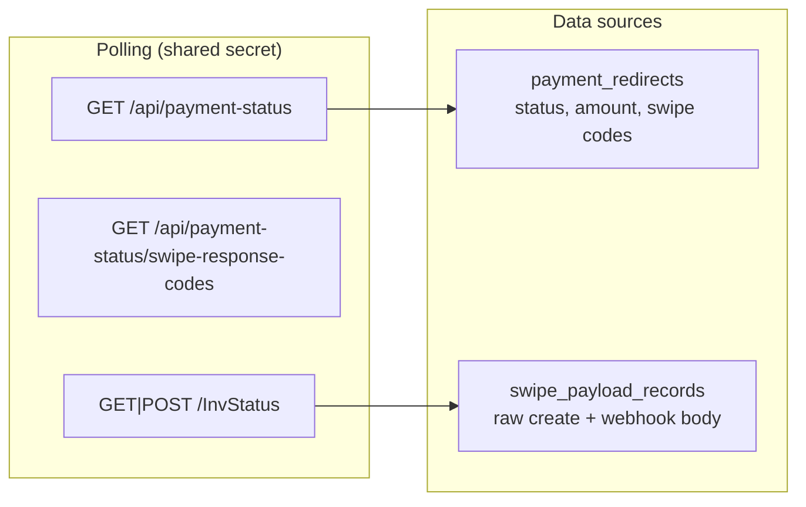


| Endpoint                  | Auth                                              | Purpose                                    |
| ------------------------- | ------------------------------------------------- | ------------------------------------------ |
| `GET /api/payment-status` | `APP_SHARED_SECRET` / `PAYMENT_STATUS_API_SECRET` | Check `pending` / `paid` / `failed` status |
| `GET /InvStatus`          | `INV_STATUS_API_SECRET` / shared secret           | Audit raw Swipe payload per invoice        |


The embedded app also exposes `GET /api/payments/swipe/transaction-log` (JWT) for Swipe transaction logs per shop.

---

## 12. Shopify compliance webhooks (GDPR)

All Shopify webhooks are verified with `**X-Shopify-Hmac-Sha256**`.

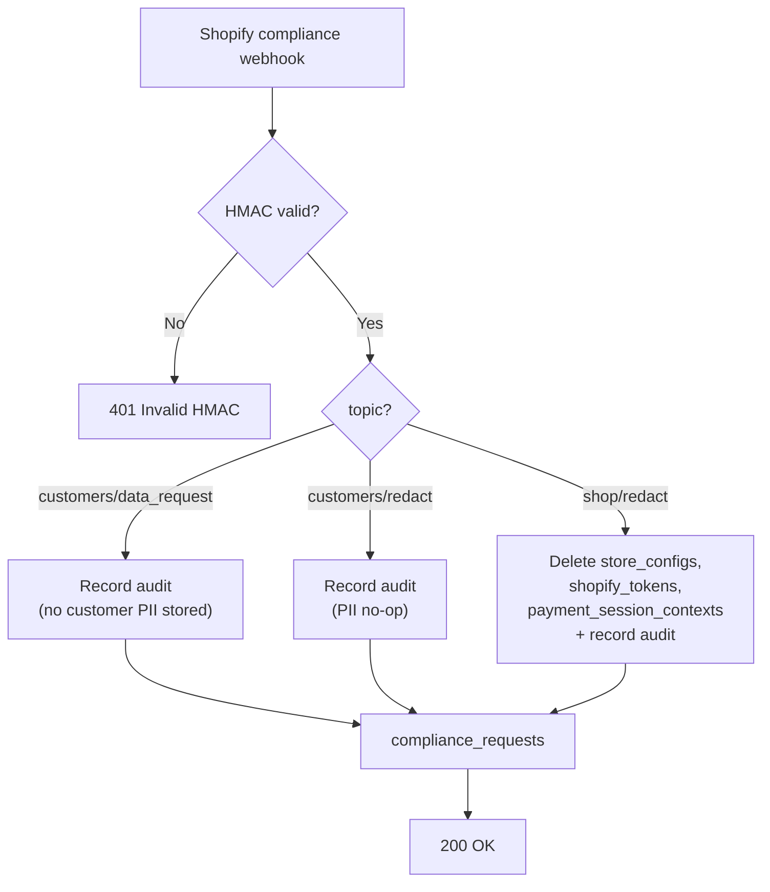


**URLs:**

- `POST /webhooks/shopify/customers/data_request`
- `POST /webhooks/shopify/customers/redact`
- `POST /webhooks/shopify/shop/redact`
- `POST /webhooks` (generic compliance router)

Audit records are available at `GET /api/compliance/requests` (JWT).

---

## 13. Data storage

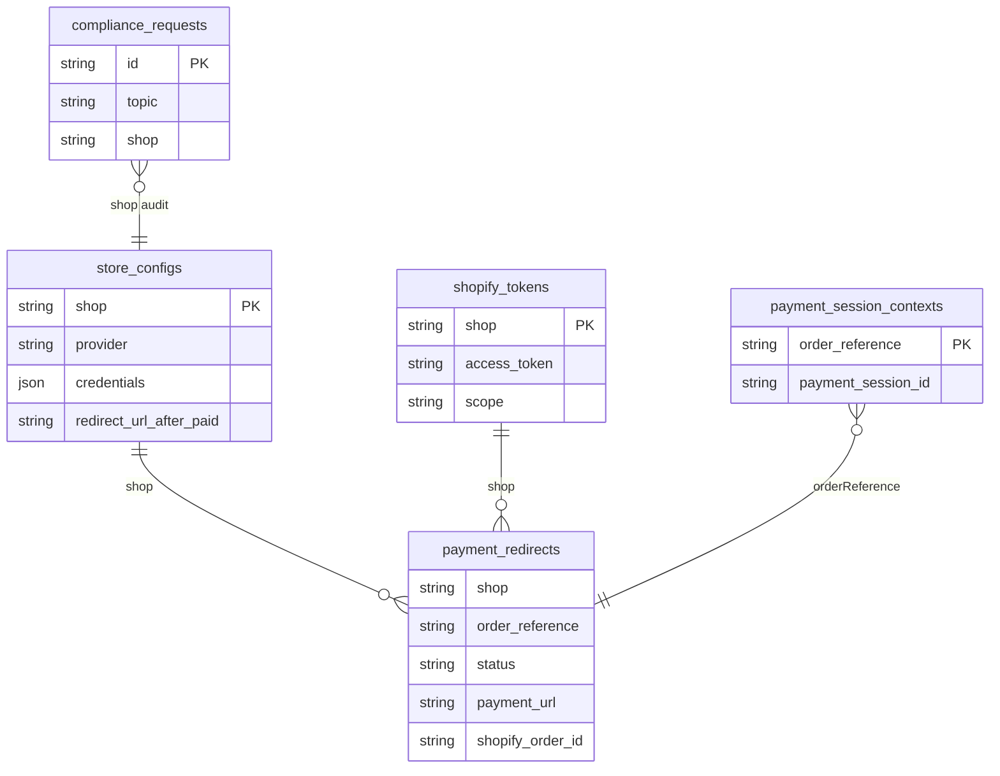


| Driver           | Env                    | Location                              |
| ---------------- | ---------------------- | ------------------------------------- |
| **JSON** (dev)   | `STORAGE_DRIVER=json`  | `./data/*.json`                       |
| **MySQL** (prod) | `STORAGE_DRIVER=mysql` | Tables in `database/mysql-schema.sql` |


Init: `npm run db:init` · JSON→MySQL migration: `npm run migrate:mysql`

---

## 14. Endpoint summary by flow

### Installation & admin (embedded JWT)


| Flow             | Method | Path                            |
| ---------------- | ------ | ------------------------------- |
| OAuth start      | `GET`  | `/auth/shopify?shop=`           |
| OAuth callback   | `GET`  | `/auth/callback`                |
| Save config      | `POST` | `/api/config`                   |
| Create checkout  | `POST` | `/api/payments/checkout/create` |
| System status    | `GET`  | `/api/system/status`            |
| Compliance audit | `GET`  | `/api/compliance/requests`      |


### Payments & webhooks


| Flow                       | Method | Path                                |
| -------------------------- | ------ | ----------------------------------- |
| Payment session            | `POST` | `/api/shopify/payment-sessions`     |
| Provider webhook           | `POST` | `/webhooks/payment/:provider/:shop` |
| Swipe webhook (query shop) | `POST` | `/webhooks/payment/swipe?shop=`     |
| Order paid (Shopify)       | `POST` | `/webhooks/shopify/orders-paid`     |
| Order create → Swipe       | `POST` | `/webhooks/shopify/orders-create`   |


### Bridge & polling (shared secret)


| Flow                | Method       | Path                          |
| ------------------- | ------------ | ----------------------------- |
| Bridge checkout     | `POST`       | `/api/bridge/checkout/create` |
| Payment status      | `GET`        | `/api/payment-status`         |
| Swipe payload audit | `GET`/`POST` | `/InvStatus`                  |


### Demo / UAT


| Flow                  | Method | Path             |
| --------------------- | ------ | ---------------- |
| Sandbox simulator     | `GET`  | `/uat/checkout`  |
| Checkout like Shopify | `GET`  | `/checkout/like` |
| Bridge docs HTML      | `GET`  | `/docs/bridge`   |


---

## End-to-end diagram (Swipe + Shopify happy path)

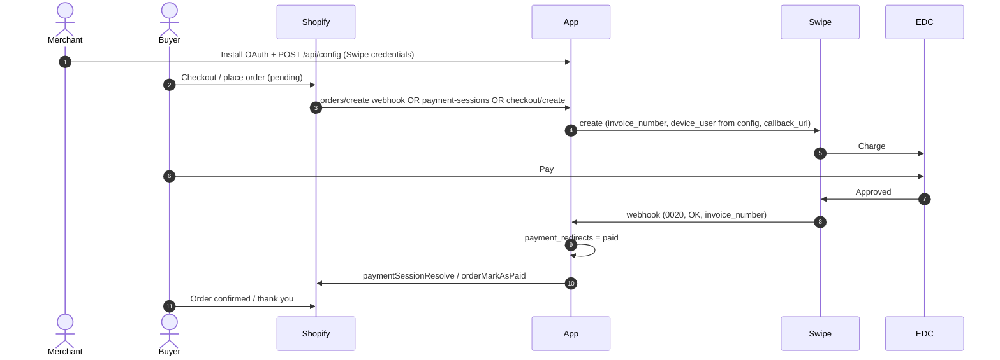


---

*Last updated 30-05-2026*